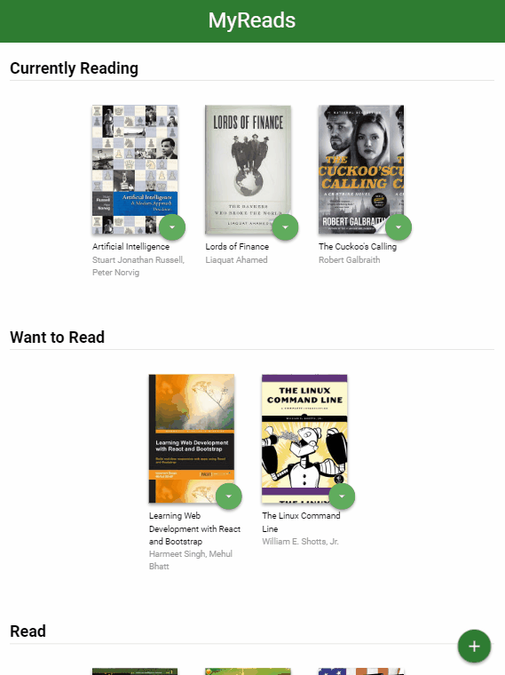

# MyReads Project

In the MyReads project, I created a bookshelf app that allows users to select and categorize books that they have read, are currently reading, or want to read. This is the final assessment project for Udacity's React Fundamentals course. 

## To get started:

* install all project dependencies with `npm install`
* start the development server with `npm start`

## Backend Server

Udacity provided a backend server, [`BooksAPI.js`](src/BooksAPI.js), for me to develop against.

## Important
The backend API uses a fixed set of cached search results and is limited to a particular set of search terms, which can be found in [SEARCH_TERMS.md](SEARCH_TERMS.md). That list of terms are the _only_ terms that will work with the backend, so don't be surprised if your searches for Basket Weaving or Bubble Wrap don't come back with any results.

